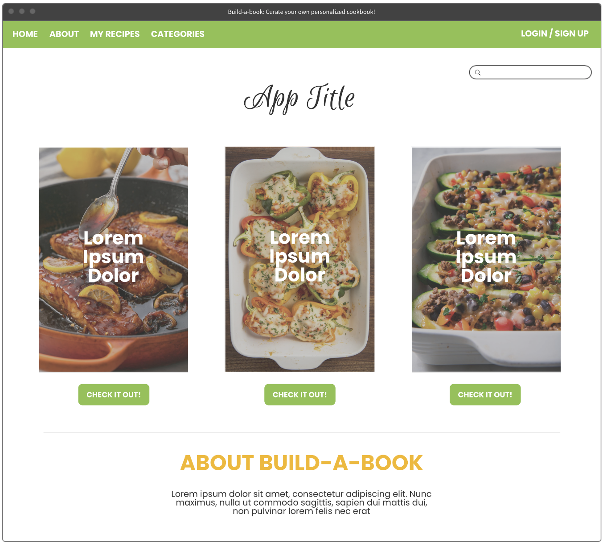
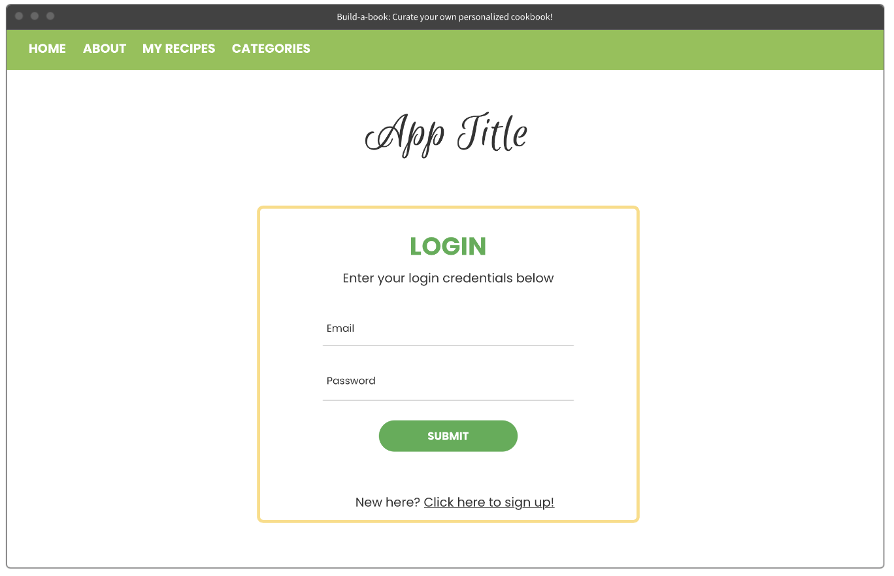
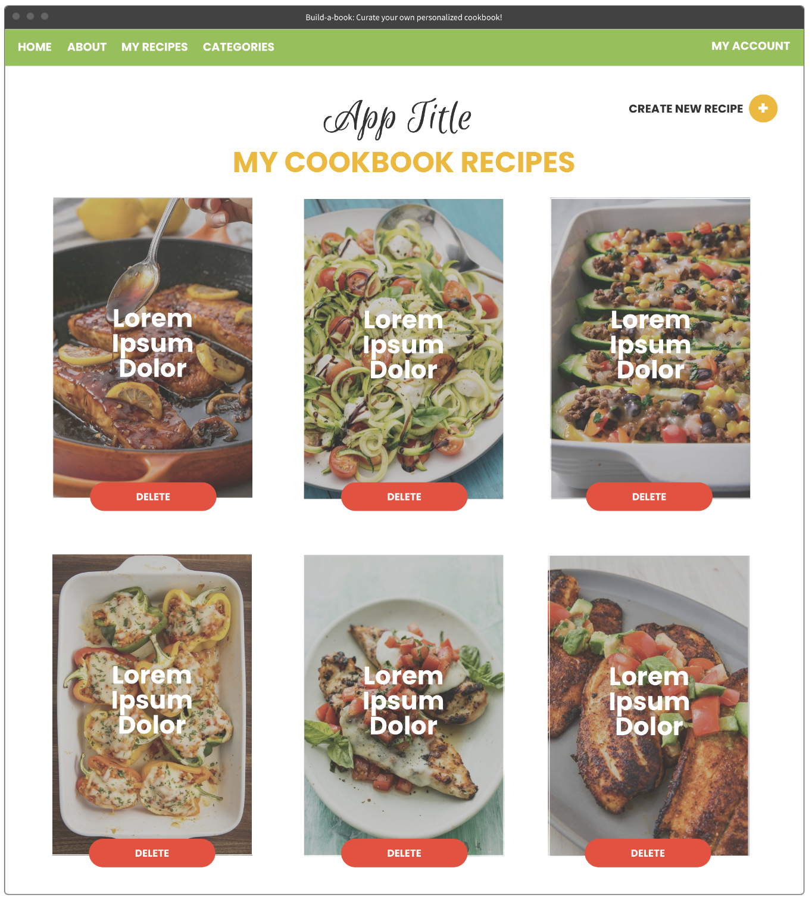
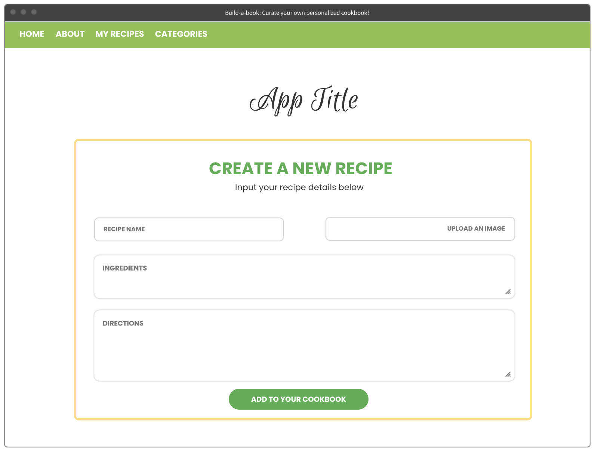
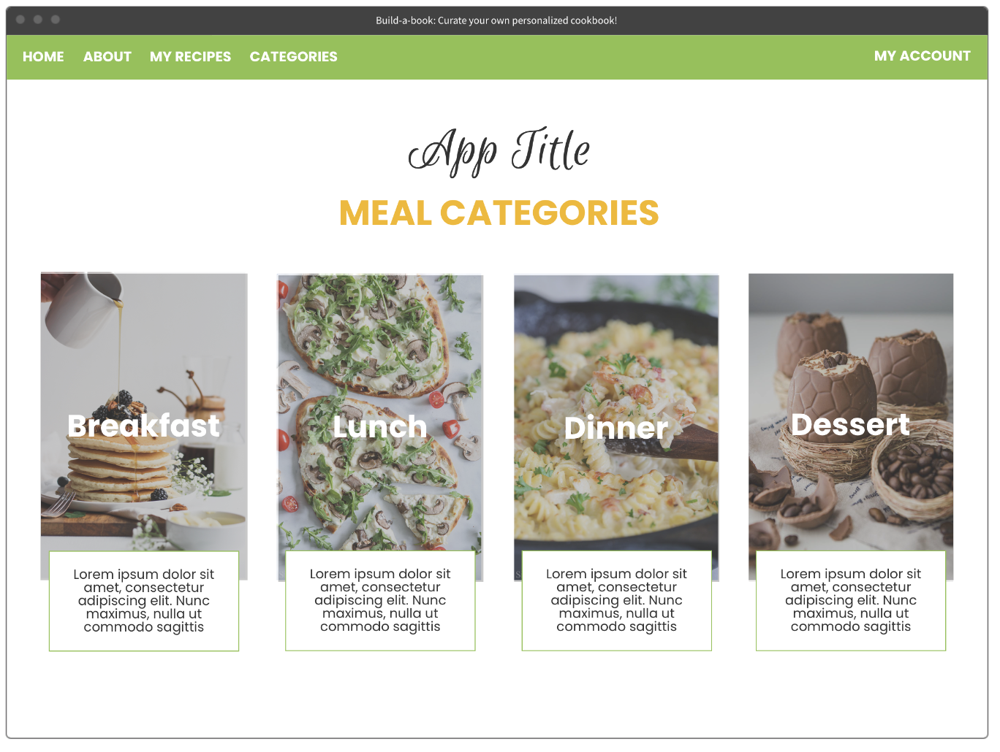
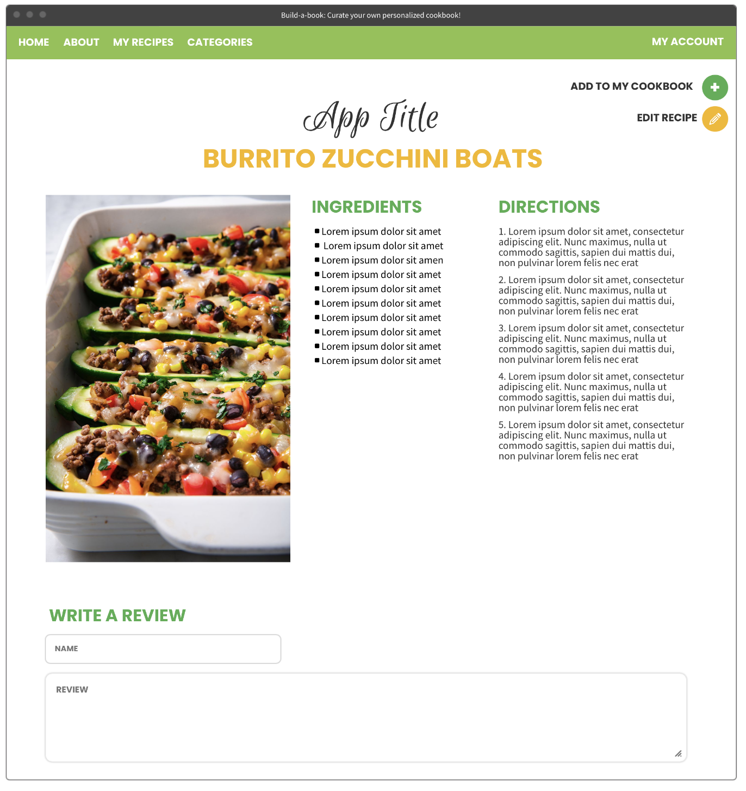

 # Cookbook Curator App

## How to Set Up:
1. Fork & Clone
2. Install dependencies
```
npm i
npm i bcrypt
```
3. Create a `config.json` with the following code:
```json
{
  "development": {
    "database": "<insert db name here>_dev",
    "host": "127.0.0.1",
    "dialect": "postgres"
  },
  "test": {
    "database": "<insert db name here>_test",
    "host": "127.0.0.1",
    "dialect": "postgres"
  },
  "production": {
    "database": "<insert db name here>_production",
    "host": "127.0.0.1",
    "dialect": "postgres"
  }
}
```
**Note:** If your database requires a username and password, you'll need to include these fields as well.

4. Create a database
```
sequelize db:create <insert db name here>
```

5. Migrate the `user` model to your database
```
sequelize db:migrate
```
6. Add a `SESSION_SECRET` and `PORT` environment variables in a `.env` file (can be any string)

7. Run `nodemon`


---

## Concept:

The Cookbook Curator app allows users to find hundreds of thousands of recipes and add them to their own personalized cookbook. Users can learn what ingredients are included in each recipe and find instructions on how to make each recipe from scratch. With the Cookbook Curator app, users can also create their own personal recipes to store these in their personal cookbook.

## Technologies Used:

* Node / Express
* CSS
* Express-EJS-Layouts
* Axios for API calls
* Sequelize
* User Auth
* [Spoonacular API](https://spoonacular.com/food-api)


## Approach:

### App Components

* Home Page
* User Auth Pages (Login/Sign Up)
* Recipe Search
* Searched Recipe Population Page
* Recipe Detail Pages
* My Recipes Show Page (Favorited Recipes)
* Category Home Page
* Meal by Category Population Pages
* New Personal Recipe Creation Page
* Personals Show Page (User Created Recipes)

### ERD

https://lucid.app/invitations/accept/ec256862-8f53-4741-942a-eda1d9ef7ca1

### Original Wireframes

\
\
\
\
\


### Color Pallet:

```
    #f4b804
    #8bc34a
    #4caf50
    #ff0000
    #000000
    #ffffff
```

### User Stories
1. User will land on a homepage and be directed to login / sign-up when any links are clicked
   * Create redirect to login page
   * Verify if user exists or if new sign up is needed (authentication)
   * Add user to user model
1. User is directed to home page after login
    * Create redirect to home page
1. User is able to view pre-populated recipes or search for new recipes
    * Set up API connection to pull from Spoonacular's API's available recipes
    * Pull in all recipe details through API
    * Redirect to recipe detail page when selected
1. User is able to add a recipe to my 'cookbook'
    * Confirm addition by navigating to 'My Recipes' page with all favorited recipes
    * CREATE route to add recipe in recipe model
1. User is able to view recipes according to category
    * Click "Categories" link to navigate to categories page
    * GET route to get recipes with certain category
1. User is able to write a review/comment on a recipe
    * PUT route to add comment to a recipe


### MVP

* MVP One: GET, POST, DELETE, & PUT routes for Commments model
* MVP Two: Functional restful routes for Recipes models 
* MVP Four: Basic CSS Styling

### Stretch Goals

* Stretch Goals One: New Personals Model
* Stretch Goals Two: Complete RESTful routes for Personals model
* Stretch Goals Three: Upgraded CSS
* Stretch Goals Four: Add in nutritional facts (not completed)

## Challenges:

I had issues implementing the edit logic for the personals model since the data was formatted in bullet points and numbered list items. Created a small workaround for working launch.

